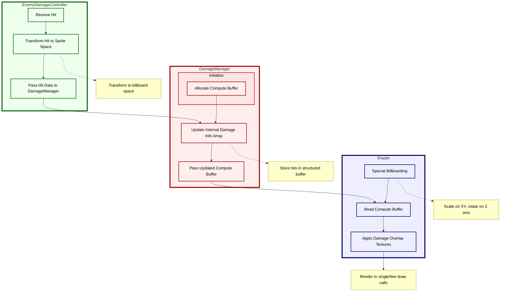
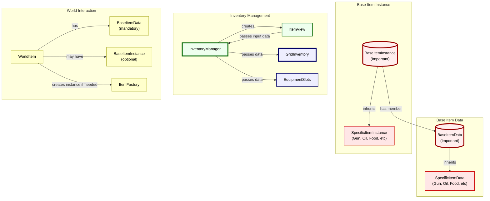

 # Welcome to Klor, a 3.5 day Sulfur technical study!

https://github.com/user-attachments/assets/2bd5c51a-14fe-40b5-844c-87c9578e9e5f

Over this weekened my goal was to reproduce iconic Sulfur features, and discover useful optomizations along the way. Sulfur is systemically mind boggling and awesome, which draws me to it. While developing the core features, I focused especailly on the grid inventory and making a shader for mass goblin murder.

>>>I've always been a sucker for cramming 1000 objects on screen

In the persuit of percision and innovation, I chose to skip some simpler gameplay elements and procedural generation. Klor is a tech demo more than a game.

## Focused Features

- **Instanced shader** for batch rendering damaged billboard sprites
- **Inventory system/item architecture** for storing, using, equipting, and trakcing items.


## GPU Instanced - Enemy Billboard Shader - with Computer Buffer reading - for Damage Application
https://github.com/user-attachments/assets/001e8c5e-c443-4189-b405-641964a68212

This is 1000 enemies, then after the cut, 2000

This secret recipe contains three ingredients:
- Special shader billboarding that supports scaling on the XY and rotating **ONLY on the Z axis** (rolling)
- Applying a transformation on enemy hit location to "billboard space"
- Filling a big ass structured buffer with hit data
- Shader instances reading from this structured buffer to all be rendered in one big happy draw call. Or a few.

>>> oh wait, that's four ingredients.

### The Unconventional Billboarding Shader

The common methods for billboard rendering are:

1. Transform manipulation to always face the camera in late update.
2. Shader that ignores the transform data and renders the sprite always facing the camera.

Both have their disadvantages. Transforms manipulation can be costly with complex scene hiararchy, or many objects. Simple shaders loose the ability to interact with the world space world.

>>>There has to be a better way

**The secret sauce** is shader billboarding the planes but incorperating the z rotation data (rolling), and XZ scaling, so these properties can be still be used for and "sticking" logic. Like a goon falling over dead riddled with bullet holes, or teetering back and forth towards the player.

```
 (Goblin, in danger)
 /\_V_/\
|  O o  |
| ,-V-. | 
```

After a day and an evening of trial and error implementing the other 3 steps, and drawing a few sadistic goblin skeletons, this is the look I ended up with:


Here's a diagram of how this approach works:


Here's some gameplay in unity with 1000 enemies. The stats screen open so you can see performance and rendering metrics! *Not bad for 1000 gross gpu goblins.*

https://github.com/user-attachments/assets/fefdab2f-e2ae-47ef-b97a-eb2d6f0872b2

>>>they say a picture is worth 1000 goblins

If I were to continue working on this approach, there's a bunch more optimizations I would look into. Definately overkill though, literally. Also, currently only works with bullet holes; thogh it can support any damage type.

I'm curious to know what method you guys use for drawing enemies and holes

## Fancy Grid Inventory

https://github.com/user-attachments/assets/044059c8-dda7-4693-b2c8-43733e84ecf7

This one is an absolute doosey of a feature, no matter how much I planned, something always came up that required a refactor.

```  
     _
    |_|    
        _
       |_|
   
   |      |
   Inventory
   |Tetris|
   \______/
```

Going in, I had a few restrictions:

- **Immutable item data** will be stored on the disk in ScriptableObjects, like item, sprite, shape, etc. This is nice, neat, and forces seperation between data and function. Easy to add new items and recipes too.
- **Mutable item data** would then have to be stored separately and have reference to the Immutable source, as well as keep track of all the real-time changes (durability, xp, oils, attached scrolls, attachments) oh my!

>>>Let's do this!

Other than these two basic ideas, I just went for it, starting with the grid by itself, since grids are kickass. Once I got that working, I had to consider rotation, which was a quick refactor (-.5 days gone).

Then, there are equipment slots OUTSIDE of the grid, which do special things!! That's pretty cool, but now there needs to be a parent InventoryManager that manages the InventoryGrid, as well as the Equipment slots.

>>> Time to pick things off the floor

Items need to be managed *while* the inventory grid/UI hierarchy is disabled! **REFACTOR REQUIRED.**
```
   _____
  |     |
  | ^_^ |  Challenge accepted!
  |_____|
    | |
    | |
   /   \
```
Solved this by seperating all the logic, and adding a new class. **NEW!** ItemViews only exists to be dragged around, and are created when the inventory UI is opened. Now, the InventoryManager, grid, and equipment slots are all functional regardless of the UI open state. 

Here's a simplified look at the different classes involved:


The system seems stable, and I'm proud of the end result, given the time constraint. *It's impossible to make an item disappear, be placed invalidly, or be deleted!* (don't try too hard)

## Other Little Invisible Things

In general, my mindset for this project was to develop Klor as if I was going to continue working. Here's a list of stuff that isn't so visual, but still cool:

1) Functional and expandable weapon system
2) Food, oils, attachments, and armor with sorting functionality, but not implemented effects
3) Factory pattern for ItemData -> ItemInstance creation
4) Editor scripts for item shape, creating bidirectional offmesh links, and showing inventory debug info
5) Interaction interface for rigidbody world items (and shops later)
6) AI behavior and optimizations

Though she's nowhere near as polished as Sulfur, Klor has some special talents. Let me know if you have any questions!
Thank you for the oppurtunity. This exercise was super fufilling, and I hope you enjoy what I came up with :]

 Next on the list is:
1. Procedural generation
2. Life and death
3. Cousin

```
   _____
  /     \
 |  \o/  |  Thanks for reading!
 |   |   |
 |  / \  |
  \_____/
```
## Sources
-Items from Sulfur wiki
-Enemy sprite from Baddool
-Text billboarding from https://github.com/Niter88/TMP_Billboard-shader
-Shader research https://gist.github.com/kaiware007/8ebad2d28638ff83b6b74970a4f70c9a
